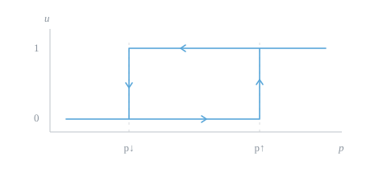

<h1 align="center">Stochastic Unit Commitment</h1>

<p align="center"><em>UC · Optimal decisions with finite memory</em></p>

<p align="center">
  <a href="https://github.com/Kcbir/uc/actions/workflows/tests.yml"></a>
  
  <a href="LICENSE"></a>
</p>

<p align="center">
  
</p>

---

UC is a numerical reference implementation for finite-horizon unit commitment under stochastic prices and net load. It combines exact dynamic programming with a compact status-history counter, preserving minimum up and down times and hot, warm, and cold startup costs.

The single-unit model maximizes expected operating profit. The fleet model minimizes expected generation, startup, unserved-energy, and overgeneration costs. Price and load uncertainty are represented by discretized AR(1) Markov chains using Tauchen or Rouwenhorst grids.

## Model

Each decision state records the current exogenous index, the previous commitment status, and the capped duration in that status. A unit has $\mathrm{UT}+\max(\mathrm{DT},T_{\mathrm{cold}}^{\mathrm{eff}})$ counter states, where $T_{\mathrm{cold}}^{\mathrm{eff}}$ is the earliest offline duration after which startup cost remains constant. Backward induction evaluates every feasible action on this finite state space.

The experiments examine price thresholds, hysteresis, and the value of retaining operating history. Explicit counterexamples show that price-threshold policies need not hold for general duration constraints and history-dependent startup costs. Fleet state spaces grow as the product of the individual counter sizes; the exact solver is intended for small fleets.

## Getting started

Use Python 3.10 or later. SciPy supplies the HiGHS solver; no separate solver installation is required.

```bash
git clone https://github.com/Kcbir/uc.git
cd uc
python3 -m venv .venv
source .venv/bin/activate
python -m pip install -r requirements.txt
python -m pytest -q
```

A single-unit solution can be computed directly:

```python
from src.dp import solve
from src.model import rts_unit
from src.price_chain import daily_profile, make_chain, stationary_distribution

unit = rts_unit("101_STEAM_3")
chain = make_chain(daily_profile(48, base=18.0, amp=45.0),
                   K=21, rho=0.9, sigma_stat=12.0)
solution = solve(unit, chain)
initial = solution.cnt.on(unit.UT)
value = stationary_distribution(chain.P) @ solution.V[0, :, initial]
print(f"Expected operating profit: ${value:,.2f}")
```

## Reproduction

The repository includes numerical results from the existing experiment run. New runs write JSON results, LaTeX tables, and eight PDF figures under `artifacts/`, preserving those reference files.

```bash
python -m src --quick                 # smaller budgets and a three-unit fleet
python -m src --workers 4             # full suite, including six-unit scaling
python -m src --output artifacts/run  # choose an output directory
python -m src --figures-only          # redraw figures from artifacts/results
python -m src --figures-only --output .  # render the bundled reference results
```

The full suite is more demanding in time and memory. Seeds and model parameters are defined in `src/experiments.py`; runtime measurements vary by machine. Verification compares the dynamic programs with exhaustive schedule enumeration, full-history recursion, deterministic HiGHS MIP solutions, and dispatch linear programs. The command returns a nonzero exit status if a verification group fails.

## Repository

| Path | Contents |
| :--- | :--- |
| `src/model.py`, `src/price_chain.py` | Unit parameters, status counters, and exogenous chains |
| `src/dp.py`, `src/fleet.py` | Exact single-unit and fleet dynamic programs |
| `src/mip.py` | Deterministic MIP and independent schedule evaluation |
| `src/experiments.py`, `src/adversary.py` | Verification, comparisons, and counterexample search |
| `src/plotting.py` | Publication figures |
| `tests/` | Exactness and structural regression tests |
| `data/`, `results/` | RTS-GMLC generator data and reference experiment outputs |

## Data and license

Generator parameters come from [RTS-GMLC](https://github.com/GridMod/RTS-GMLC), credited to DOE/NREL/ALLIANCE. Heat-rate curves are reduced to linear operating costs; price and load profiles are illustrative. The upstream data-use notice is preserved in [data/NOTICE.md](data/NOTICE.md).

The project code is available under the [MIT License](LICENSE). The bundled generator data retain their upstream terms.
